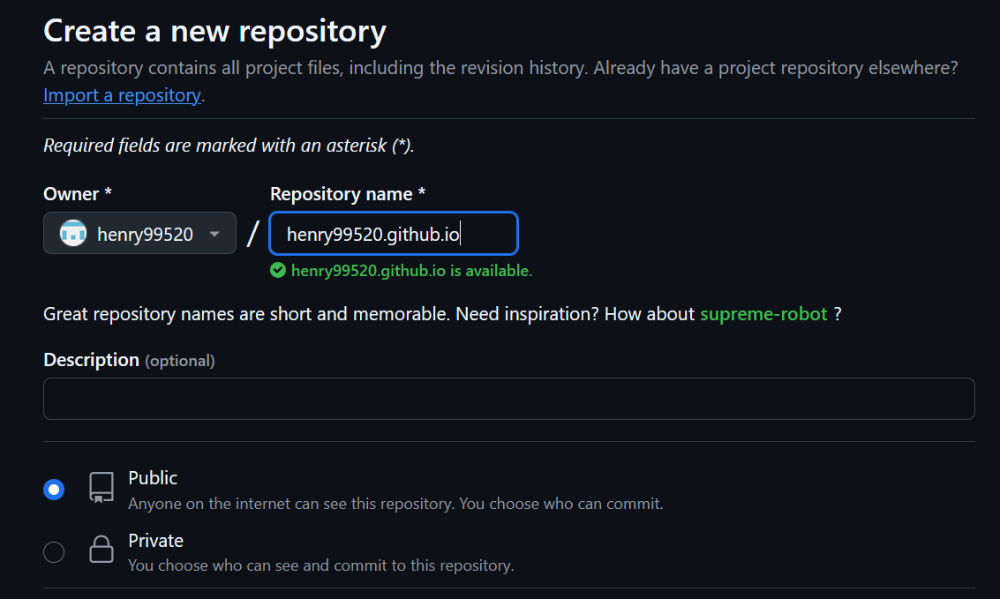
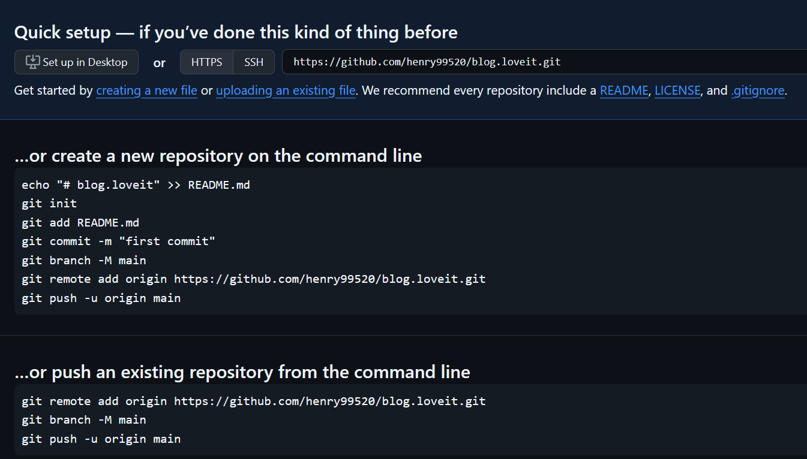
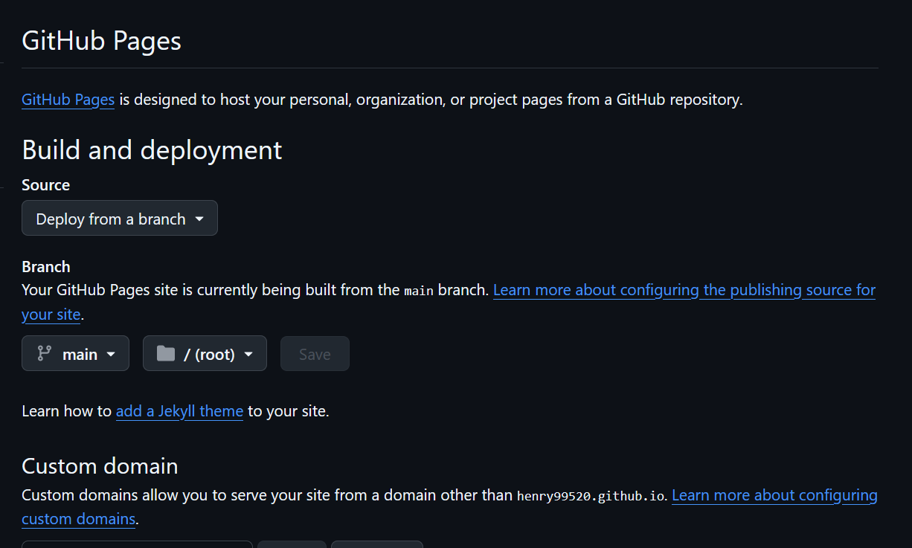
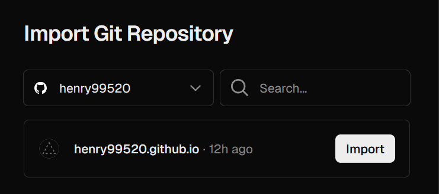
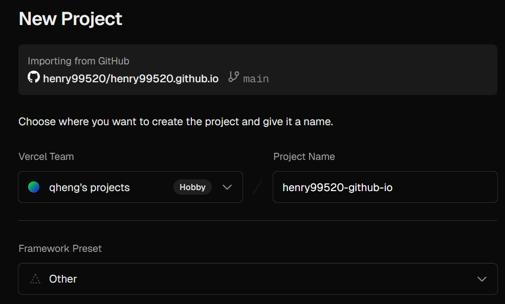
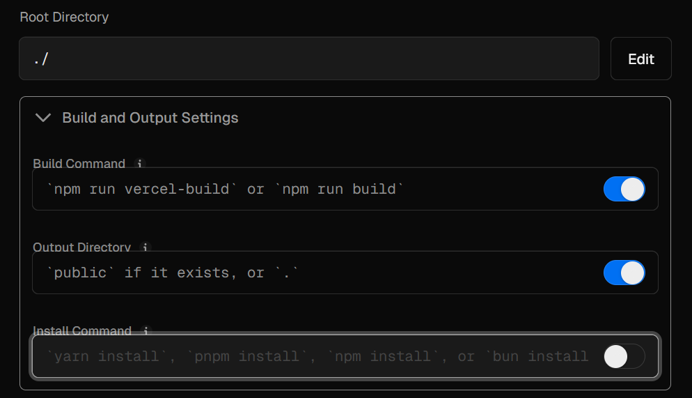
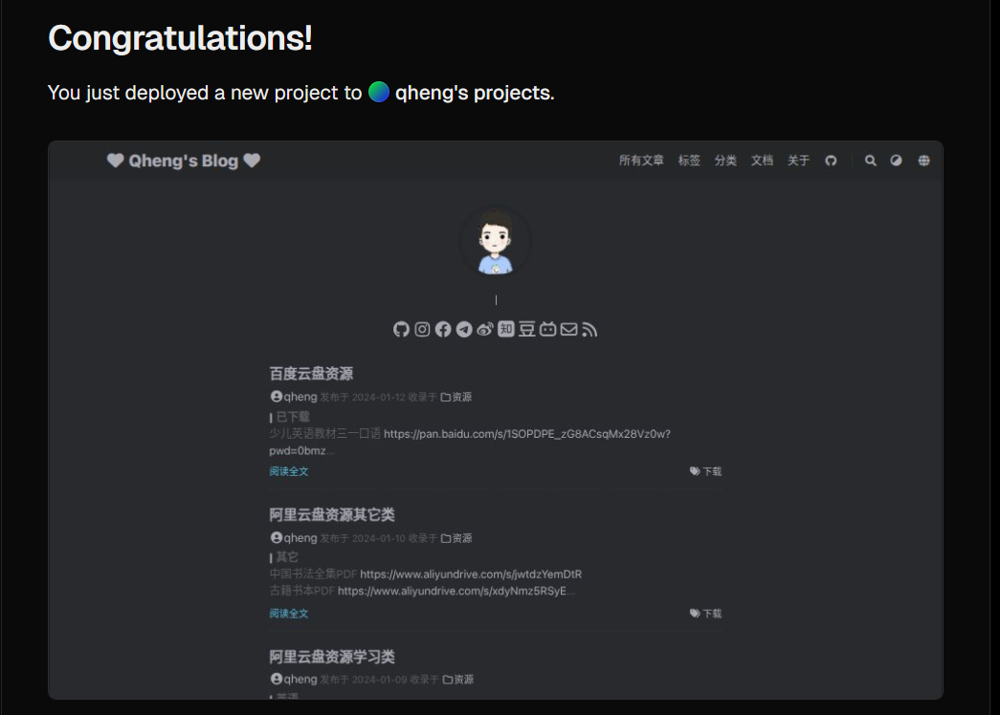
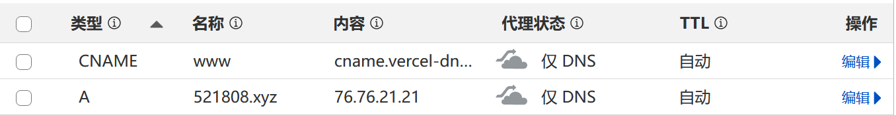
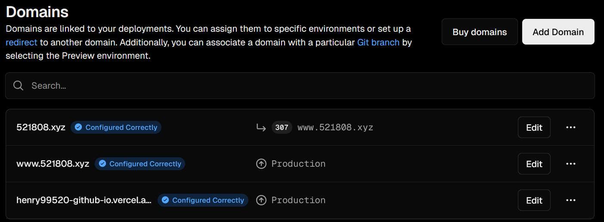

# Hugo创建博客及部署


<!--more-->

## 新建 Hugo 网站

1.新建一个目录，用于存放 Hugo 网站的文件

2.打开命令行，切换到该目录，执行命令新建一个 Hugo 网站

~~~bash
hugo new site blog
cd blog
~~~

## 选择 Hugo 主题

1.打开 hugo theme 的网站，选择合适的主题，这里选择LoveIt

2.可以选择下载主题文件并解压放到 theme 目录下，或者克隆主题

```
git clone https://github.com/dillonzq/LoveIt.git themes/LoveIt
```

3.在 Hugo 网站的根目录下配置 hugo.toml，可将主题文件例子中的配置拷贝过来再修改，具体暂时略

## 新建文章

1.新建文章：first-post.md

~~~bash
hugo new posts/first-post.md
~~~

2.编辑文章内容并保存

3.启动 Hogo server

~~~bash
hugo serve -D
~~~

4.打开网址 http://localhost:1313/ 可以进行预览

## 部署 Github Pages

1.在github上新建一个仓库，选择公开的，名称一定是 github用户名.github.io，这样才能通过这个域名访问



2.创建后的页面如下，说明后续应该如何操作，注意的是其中要使用 main 不能使用 master



3.点击上面的Settings 菜单，然后在左面菜单里选择 Pages，打开的页面要保证如图所示



4.接下来需要把本地的静态页面上传到github上

~~~bash
cd public
git init
git add .
git commit -m "first commit"
git branch -M main
git remote add origin https://github.com/henry99520/henry99520.github.io.git
git push -u origin main
~~~

正常情况下就github上就有了上传的文件，同时有个自动build的操作，我的Hugo生成的文件传到上面没有build成功，所以网站打开一直是404错误，通过询问ChatGPT最终得以解决，方式是在根目录添加一个.nojekyll文件，因为build过程中调用了jekyll，这看起来是个奇怪的现象。打开 https://henry99520.github.io 网站正常访问

5.接下来可以绑定自定义的域名，在Pages页面下有Custom domain选项，里面填上自定义的域名，我这里使用了二级域名，同时在cloudflare里面配置对应的DNS记录，具体要指定的IP地址可参考[Github Docs](https://docs.github.com/en/pages/configuring-a-custom-domain-for-your-github-pages-site/managing-a-custom-domain-for-your-github-pages-site#configuring-an-apex-domain)，其中的四个IP都需要填上

## 部署 Vercel

1.注册并且关联github账号，因为vercel需要从github上拉取代码部署

2.选择需要部署的GitHub下的仓库



3.创建新的项目



4.下面两项开启，看别人这样设置，原因还未知



5.之后就是创建成功的页面



6.这时候系统会提供一个域名https://henry99520-github-io.vercel.app/，可以自定义域名，选择添加域名，在cloudflare中配置DNS



然后在Vercel页面上看到如下内容就成功了




下面一些和LoveIt主题相关的网站，暂作参考

[Stilig](https://stilig.me/)

[雨临Lewis](https://lewky.cn/)

[Duan1v](https://duan1v.top/)

[TechKoala](https://www.techkoala.net/)

[Raylan yao](https://www.raylanyao.com/)

[Jelly's blog](https://jellyzhang.github.io/)

[Simumis](https://simumis.com/)

[建站](https://github.com/zz2summer/blog-hugo-theme-LoveIt)

[标小智](https://www.logosc.cn/favicon-generator)

[Notion](https://www.notion.so/) gmail注册

